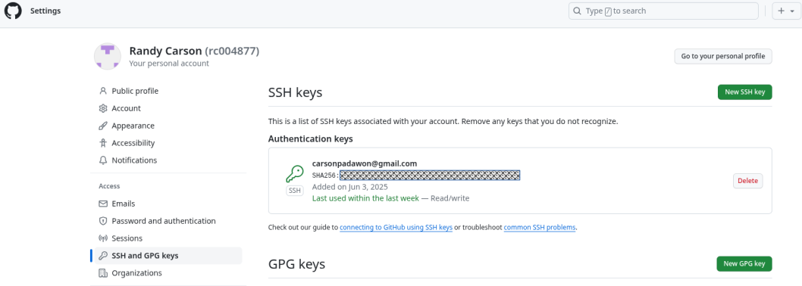

# Tasks done to rebuild the lab
## Services to add in order
1. Consumption Interface Service.
    * Use beta yaml in this folder
2. Contour Service.
    * Use data values file in tis folder
3. Harbor Service
    * Create Storage Policy.  Name it **k8s-harbor**
    * Add harbor FQDN to DNS.  FQDN is **harbor-01a.site-a.vcf.lab**.  
    NOTE: add this to local console host table until the DNSMasq app is fixed.  
    * Harbor IP address is the external ingress controller IP from the Contour service.
## vsCode setup
1. Validate you can ssh into the manager VM & console VM
    * Manger VM is at vPOD external IP address port 5480
    * Console VM is at vPOD external IP address port 22
    * Use the ssh-copy-id to copy a SSH public key, from local machine, to both manager & console VMs.
    * Setup a ~/.ssh/config file with these setting:
    ```
    Host manager
    HostName xxx.xxx.xxx.xxx **vPOD external IP**
    User holuser
    Port 5480
    IdentityFile ~/.ssh/id_ed25519
    
    Host console
    HostName xxx.xxx.xxx.xxx **vPOD external IP**
    User root
    Port 22
    IdentityFile ~/.ssh/id_ed25519
    ```
2. Connect local vsCode instance to HOL-2633 repo
    * Copy a local SSH public key to PSO github profile.  As shown in this screenshot
    * 
    * in vsCode connect to a new repo using the SSH path to the repo: ```git@github-vcf.devops.broadcom.net:PSO/HOL-2633.git```
